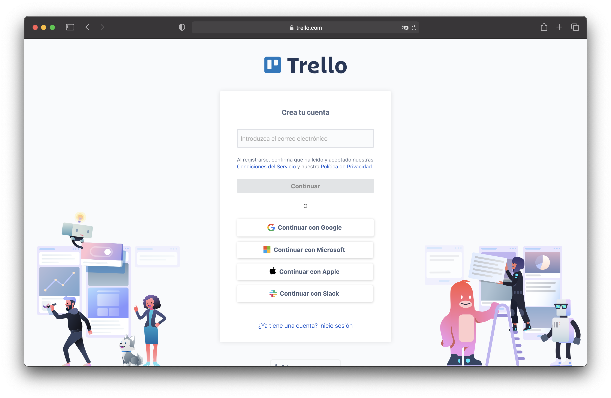
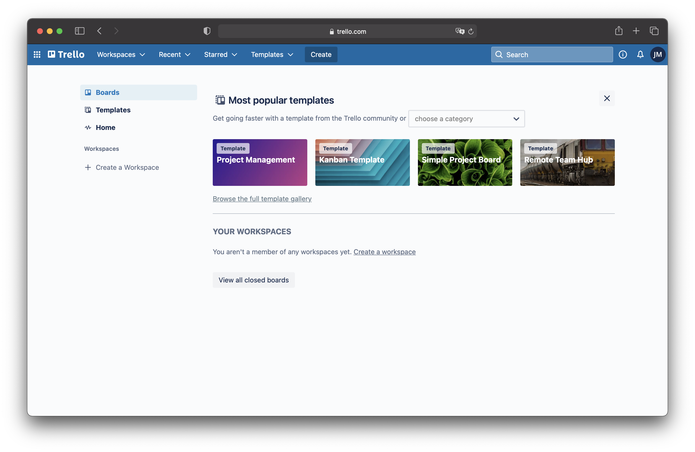
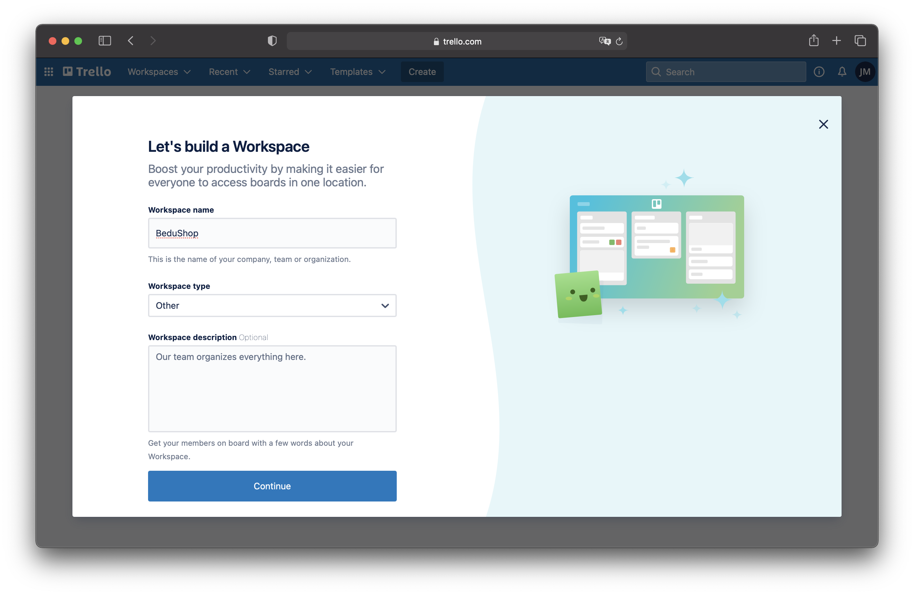
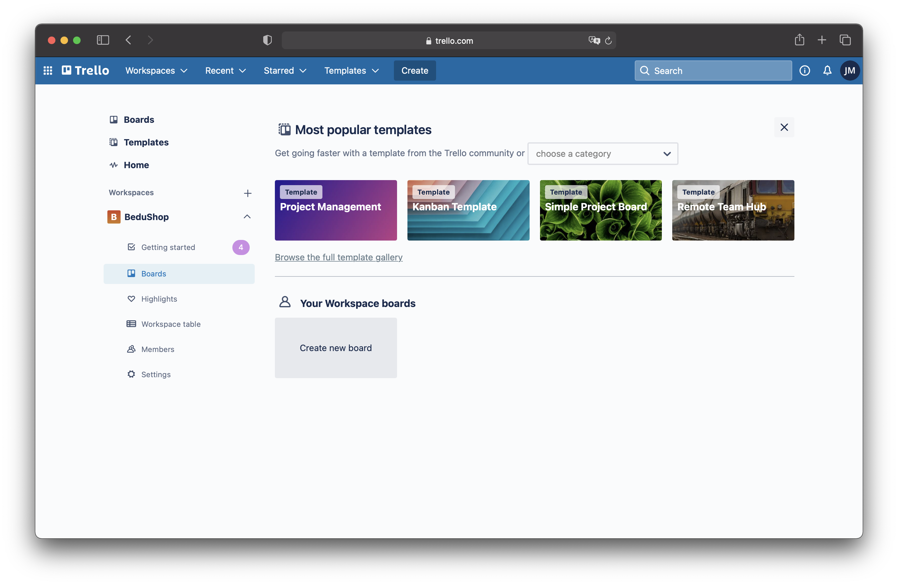
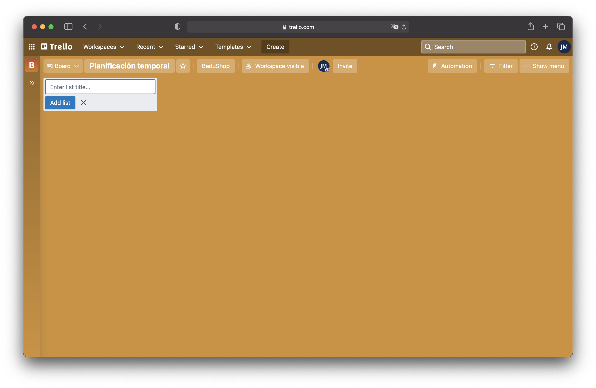
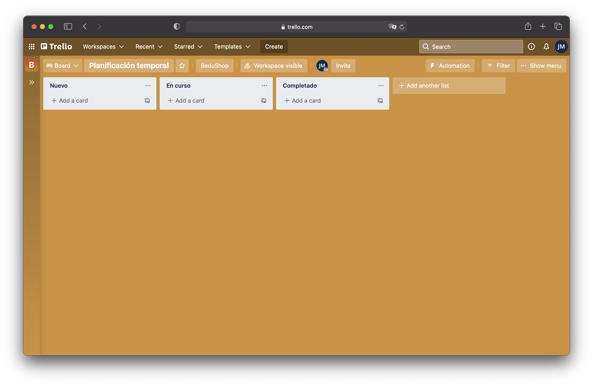
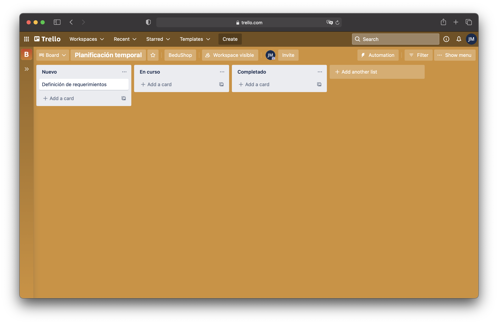
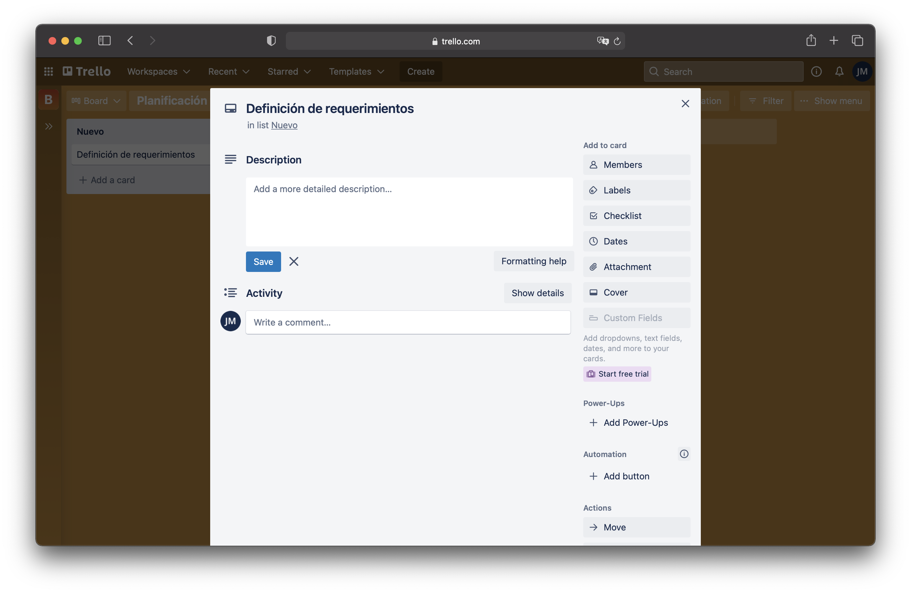
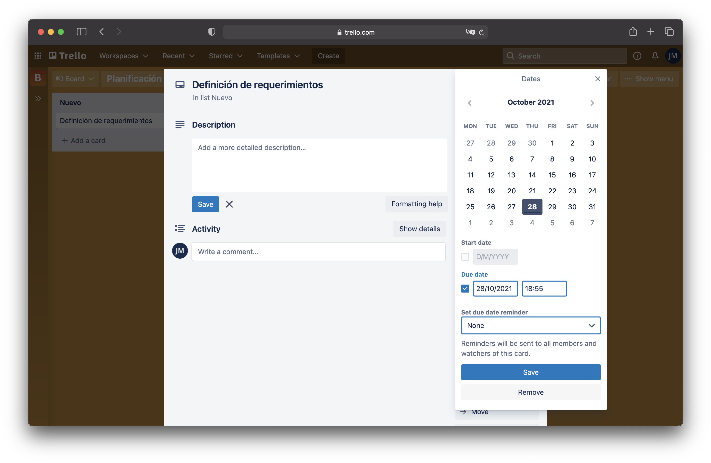
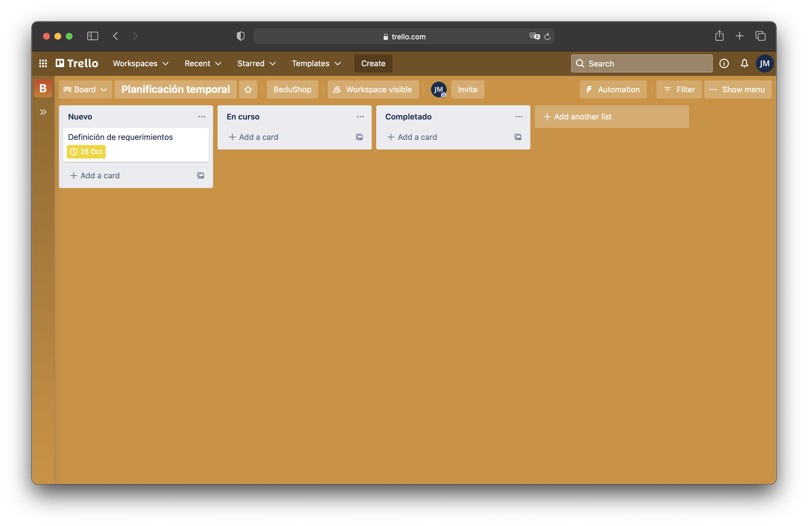

[`Backend Fundamentals`](../../README.md) > [`Sesión 01`](../README.md) > `Ejemplo 1`

# Ejemplo 1: Alcance y planificación del proyecto

**Objetivo:**

- Definir el alcance del proyecto.
- Dar una calendarización para las entregas parciales del proyecto.

**Requerimientos:**

- Navegador web y cuaderno o aplicación para tomar notas.

---

## Desarrollo

Antes de comenzar a definir  el alcance que tendrá el proyecto es necesario entender que es lo que hace una aplicación de _backend_.

Hasta ahora en el curso se había estado trabajando unicamente con la vista de las aplicaciones web, es decir, con la interfaz a la que los usuarios y usuarias tienen acceso y mediante la cual interactua con nuestra aplicación. A este trabajo se le conoce como _frontend_. 

El _backend_ es la parte del desarrollo web que se encarga de que toda la lógica de una página web funcione. Se trata del conjunto de acciones que pasan en una web pero que no vemos. Es la parte que se conecta con la base de datos y el servidor que utiliza dicho sitio web, por eso decimos que el _backend_ corre del lado del servidor.

_Backend_ es la capa de acceso a los datos, que no es directamente accesible por los usuarios, además contiene la lógica de la aplicación que maneja dichos datos. 

El _Backend_ está compuesto por 3 partes fundamentales:

- **Servidor**
- **Base de Datos**
- **Middleware**

--- 

### Your mission if you choose to accept it 

Durante todo este módulo estaremos desarrollando una aplicación de _backend_, en cada sesión la iremos completando o perfeccionando para que al termino de la última sesión este completa y funcional. Nos vamos a concentrar exclusivamente en el desarrollo del backend, esto quiere decir que nos vamos a olvidar completamente del desarrollo del _frontend_.

 

Pero antes de comenzar con el desarrollo tenemos que dejar bien claro ¿Qué es lo que hará la aplicación? y ¿Cómo lo hará?

----

### Definición del alcance del proyecto.

El alcance de un proyecto se define respondiendo una simple pregunta 

**¿Cómo esperamos que funcione nuestra aplicación?**

Esta pregunta es muy ambigua, y para ayudarnos a responderla primero definiremos cada uno de los siguientes puntos: 

 - **Objetivos del proyecto**
 - **Fases del proyecto**
 - **Programación temporal**

#### Objetivos del proyecto

Los objetivos del proyecto se refieren específicamente a **¿Que debe hacer?** y estos casi siempre son dados por el cliente al cuál vamos a vender la aplicación. En este caso nosotros definiremos los objetivos generales del proyecto.

La aplicación será un _backend_ para un marketplace con los siguientes objetivos:

- Que los usuarios puedan vender y comprar productos.
- Que se puedan escribir reseñas sobre los productos.
- Que un usuario pueda consultar el historial de los productos que compro. 
- Que se incluya la información relevante de los productos como lo es: precio, descripción, categoría, marca, etc.
- Que un vendedor pueda dar de alta nuevos productos.
- Que un vendedor pueda dar de baja productos ya no existentes.

Es importante notar como estos objetivos están definidos lejos de la especificación técnica, es decir, no hablan de la implementación de ellos. Solo son frases que describen lo que el cliente quiere.

### Fases del proyecto 

Las fases se refieren a esas etapas que constituyen la creación del proyecto. Es importante definir cuál será el resultado de cada una de las fases, es decir, que obtendremos cuando termine cierta fase. Nuestro proyecto se va a dividir en las siguientes fases:

- **Planificación**: La fase actual en la que se define el alcance del proyecto y las herramientas para el desarrollo.
- **Diseño**: Fase en la que se definen los requerimientos y las especificaciones técnicas.
- **Desarrollo**: Esta es la etapa que más tiempo requiere y es en la que se escribe el código del programa.
- **Testing**: Una fase de pruebas sobre la implementación obtenida en la fase anterior.
- **Fixes**: Correcciones de errores encontrados en la fase de testing.
- **Deploy**: Liberación del proyecto, en esta fase el proyecto se publica para su uso por usuarios reales.
- **Mantenimiento**: Después de la liberación del proyecto se debe seguir al pendiente de aparición de errores (bugs) para corregirlos.

#### Programación temporal

La programación temporal se refiere a la calendarización de las tareas y fases definidas para el proyecto. Aquí se dan fechas de entregas parciales del desarrollo del proyecto. Estas fechas deben respetarse para que la programación funcione correctamente. 

Para esto usaremos una herramienta de organización llamada [Trello](https://trello.com) que nos ayudara a planificar y organizar nuestro proyecto.

1. Entramos a la consola de [Trello](https://trello.com).

 

2. Damos click en el botón que dice *Sign up* que se encuentra en la parte superior derecha. Y nos registramos o iniciamos sesión si ya tenemos una cuenta.

 

3. Eso nos abrirá la siguiente pantalla en donde podemos ver los espacios de trabajo que hemos definido. Así como algunos templates para iniciar uno nuevo.

 

4. Seleccionamos la opción *Create a Workspace*. Y agregamos como nombre del espacio **BeduShop** y en el tipo de _workspace_ Other. Y damos click en el botón *Continue*.

 

5. Abrimos el nuevo _workspace_ y seleccionamos la opción _Boards_. Y seleccionamos _Create new board_

 

6. Le damos como título **Planificación Temporal** y seleccionamos el color que mas nos guste. Y damos click en _Create board_.

 

7. Agregamos las columnas: **Nuevo**, **En curso** y **Completado** que definen las tres etapas por las que pasará cada una de las tareas que realizaremos durante el módulo. El tablero debe quedar como el de la imagen:

8. Ahora agregaremos una nueva tarea, dentro de la lista de **Nuevo** seleccionamos la opción _Add a card_ y agregamos el título definición de requerimientos.

 

9. Damos click sobre la tarea, lo que abre una nueva ventana con mas opciones para definir la tarea.

 

10. Seleccionamos la opción _Date_ para agregar una fecha de entrega, y agregamos la fecha del día de hoy. En la opción de recordatorios seleccionamos la opción _None_ o nos llegaran muchos correos de Trello indicando que tenemos que entregar esa tarea.

 

11. Guardamos los cambios.

 

Trello nos permite mover todas las tareas que definimos entre las columnas del tablero para indicar en que proceso de desarrollo. También nos permite agregar colaboradores para asignar tareas a miembros específicos del equipo de desarrollo.

---

[`Atrás: Sesión 03`](../README.md) | [`Siguiente: Ejemplo 02`](../Reto-01)

