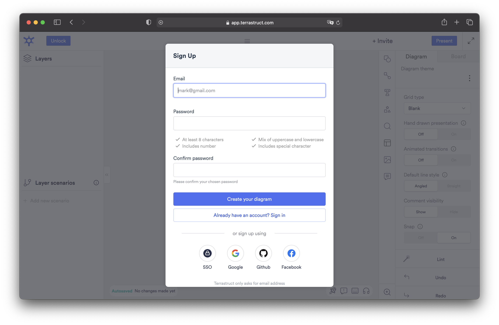
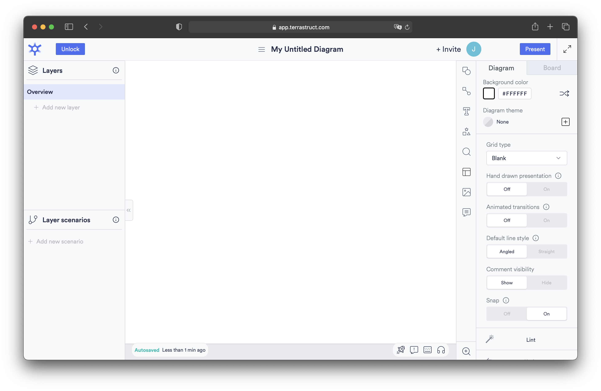
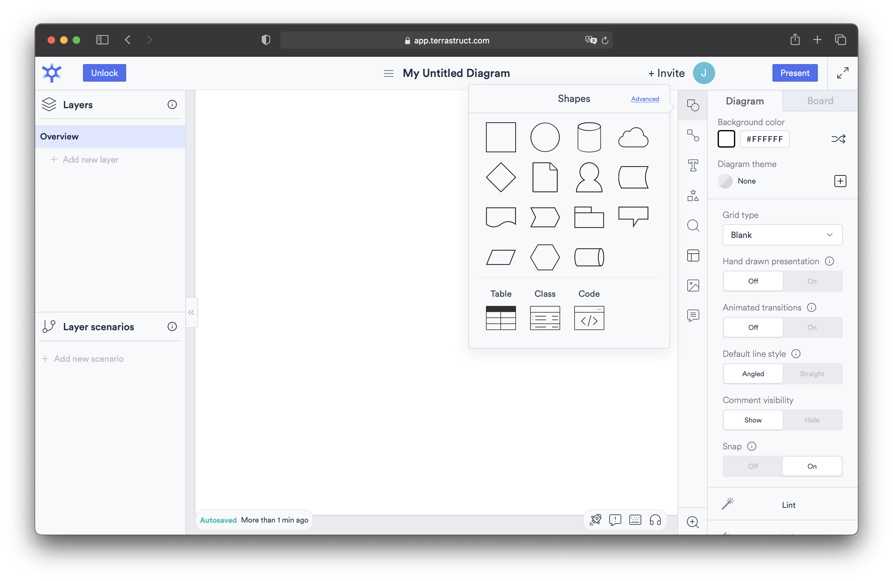
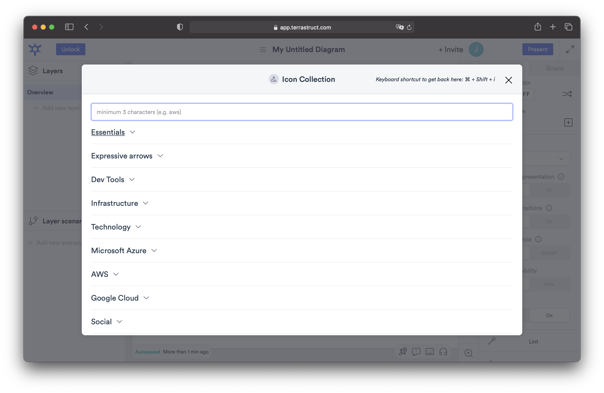
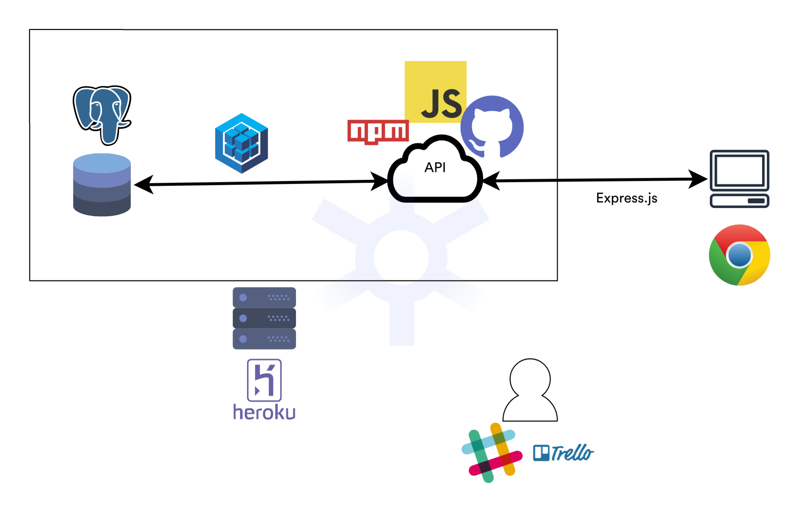
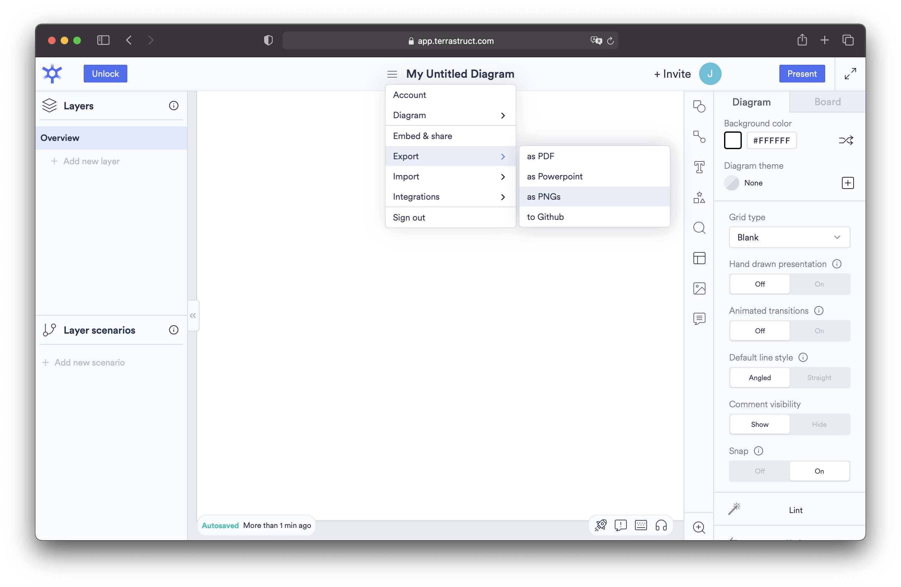

[`Backend Fundamentals`](../../README.md) > [`Sesión 01`](../README.md) > `Ejemplo 2`

# Ejemplo 2: Definición de las herramientas

**Objetivo:**

- Identificar las herramientas que utilizaremos para el desarrollo del proyecto.
- Generar un diagrama en donde se muestre la organización del proyecto.

**Requerimientos:**

- Navegador web y cuaderno o aplicación para tomar notas.

---

## Desarrollo

En este ejemplo vamos a construir un diagrama con todas las herramientas que vamos a utilizar para el desarrollo del proyecto utilizando la herramienta [TerraStruct](https://app.terrastruct.com).

1. Abrimos [TerraStruct](https://app.terrastruct.com) en el navegador y creamos una cuenta o iniciamos sesión.

2. En esta aplicación tenemos un lienzo en blanco en el cuál se puede definir el diagrama con la estructura del proyecto. 

3. Del lado derecho tenemos un menú con diferentes opciones de elementos para agregar a nuestro diagrama. Utilizaremos principalmente los _Shapes_.

y los _Icons_

4. Vamos a dibujar el siguiente diagrama

Y ahora vamos a entender que nos está diciendo.

- El rectángulo que se encuentra en la parte superior izquierda, define la aplicación de _backend_.
- Dentro del _backend_ tenemos una base de datos de PostgreSQL.
- Y una API desarrollada en JavaScript con npm y con github como gestor de versiones que se comunica con la base de datos con sequelize.
- Todo el _backend_ está hosteado en Heroku.
- El _backend_ se comunica con un cliente a través de Express.js en un navegador.
- En la parte inferior podemos ver que el equipo de desarrollo utiliza Slack y Trello para la comunicación y organización respectivamente.

Todas estas son las herramientas que exploraremos durante el módulo, en donde cada una nos servira para resolver tareas en especifico.

En el diagrama se puede observar la estructura completa que tendrá nuestro proyecto. Estos diagramas son de gran utilidad ya que representan de forma intuitiva la arquitectura del proyecto que se está desarrollando.

5. Para descargar el diagrama y guardarlo como parte de la documentación, damos click en el menú de hamburguesa > Export y luego seleccionamos la opción a la cuál queramos exportarlo.

-------

[`Atrás: Reto 01`](../Reto-01) | [`Siguiente: Sesión`](../README.md)

