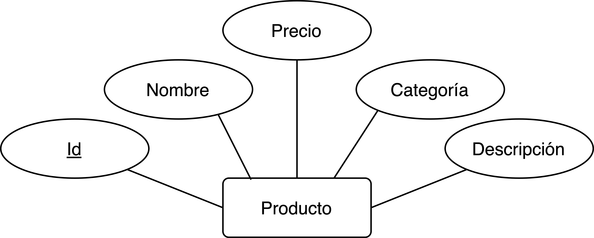
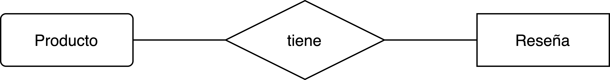

[`Backend Fundamentals`](../../README.md) > [`Sesión 02: Introducción a Bases de datos`](../README.md/) > `Ejemplo 1`

# Ejemplo 1: Diseño de una base de datos

**Objetivos:**

- Aprender los fundamentos de diseño de una base de datos relacional
- Generar diagramas que nos permitan modelar la base de datos.

**Requerimientos**

Un navegador web

# Desarrollo

Para este ejemplo veremos dos diagramas de gran utilidad en el proceso de diseño de una base de datos. Estos diagramas son el Modelo Entidad Relación y el Modelo Relacional. Para poder dibujarlos de forma sencilla se puede utilizar herramientas como [draw.io](draw.io)

## Modelo Entidad Relación

El modelo entidad-relación se basa en tres conceptos clave: 
- **Entidad**
- **Atributo** 
- **Relación**.

Veamos con detalle cada uno de estos y como se adaptan a nuestro proyecto colaborativo.

### Entidad

La entidad es la representación de un objeto que puede ser real o abstracto. Las entidades son esos modelos que identificamos en la sesión anterior, aquellos que representan actores de nuestro proyecto. Entonces nuestras entidades son:

- Producto
- Usuario 
- Venta 
- Reseña

En el diagrama una entidad se representa en forma de rectángulos con el nombre de la entidad, como los siguientes:

### Atributo 

Los atributos son los componentes o características que determina una entidad. Representan la información que deseamos guardad de cada entidad. 

Por ejemplo, para la entidad producto tenemos los siguientes atributos:

- Id
- Nombre
- Precio
- Descripción
- Categoría

En el diagrama los atributos tienen la forma de óvalo y estas conectados a la entidad sobre la cuál se definen,  como se muestra a continuación:

El *Id* será el atributo con el cual identificaremos univocamente cada entidad y que mediante relaciones podremos acceder a la entidad. Este atributo se conoce como **clave** y se representa subrayando su nombre.

### Relación 

Una relación es una asociación entre varias entidades. Por ejemplo, las entidades producto y reseña están relacionadas y el nombre de esta relación es *tiene*

En un diagrama podemos observar una relación en forma de rombo y conectada a las entidades que relaciona:

Existen diferentes tipos de relaciones, estas se diferencian por su cardinalidad, es decir el número de registros que relacionan de cada una de las entidades. Y de esta forma tenemos 3 tipos de relaciones:

**1:1**

**1:N o N:1**

**N:N**

Nuestra relación entre producto y reseña es **1:N** pues un producto tiene muchas reseñas pero cada reseña es exclusivamente sobre un producto.

## Modelo Relacional

El modelo ER facilita las tareas de diseño conceptual de base de datos pero es necesario traducirlo a un esquema que sea compatible con un **Sistema de Gestión de Base de Datos** como lo es PostgreSQL.

El Modelo relacional es utilizado por la mayoría de los SGDB existentes en el mercado (Oracle, SQL Server, MaríaDB, SQLite).

En el modelo relacional se utiliza un grupo de **tablas** para representar los datos y las relaciones entre ellos. Cada tabla está compuesta por varias **columnas** que representan los atributos de la entidad y **filas** que serán **registros** o **tuplas**.

### Restricciones de integridad

La integridad de los datos es la propiedad que asegura que información dada es correcta, al cumplir ciertas aserciones. Las restricciones de integridad son propiedades de la base de datos que se deben satisfacer en cualquier momento entre las cuales están:

- Integridad de clave primaria
- Integridad referencial
- Tratamiento de valores nulos
- Valores por defecto

### ¿Cómo pasar del Modelo ER al Modelo Relacional?

Del ejemplo de la entidad "*Producto"*

Hemos hablado que el modelo relacional son tablas y columnas, en este ejemplo la entidad *"Producto"* será el nombre de nuestra tabla y cada atributo será una fila.

Como lo vimos anteriormente el uso de **claves** es importante ya que se utilizan para definir relaciones. Las tablas se relacionan mediante una ***"relación de clave primaria o de clave foránea"***, dónde:

- **Llave primaria**: Es una columna o conjunto de columnas en una tabla cuyos valores identifican de forma exclusiva un registro de la tabla.
- **Llave foránea**: Es una columna o conjunto de columnas en una tabla cuyos valores corresponden a los valores de la clave primaria de otra tabla.

[`Atrás: Sesión 02`](../README.md) | [`Siguiente: Reto 01`](../Reto-01)
