[`Backend Fundamentals`](../../README.md) > [`Sesión 02: Introducción a Bases de datos`](../README.md/) > `Ejemplo 3`

# Ejemplo 3: Creación de la base de datos

**Objetivo:**

- Traducir el diseño del ejemplo 1 a una base de datos en PostgreSQL

**Requisitos:**

- PgAdmin
- Servidor de base de datos en Heroku
- Diseño de la base de datos completado

## Desarrollo

1. En la barra lateral de pgAdmin abrimos **Servers > bedushop > Databases > El nombre de la base de datos > Schemas**

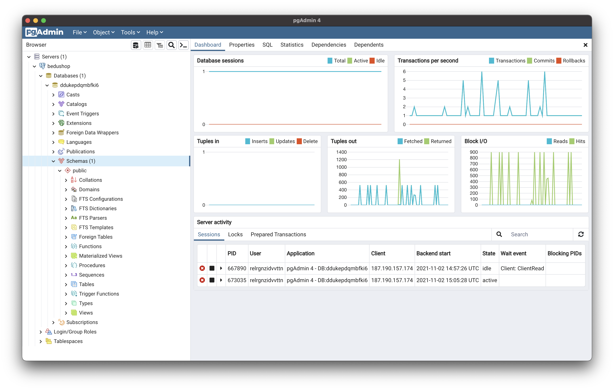

2. Damos click derecho sobre **Tables** y seleccionamos **Create > Table**.

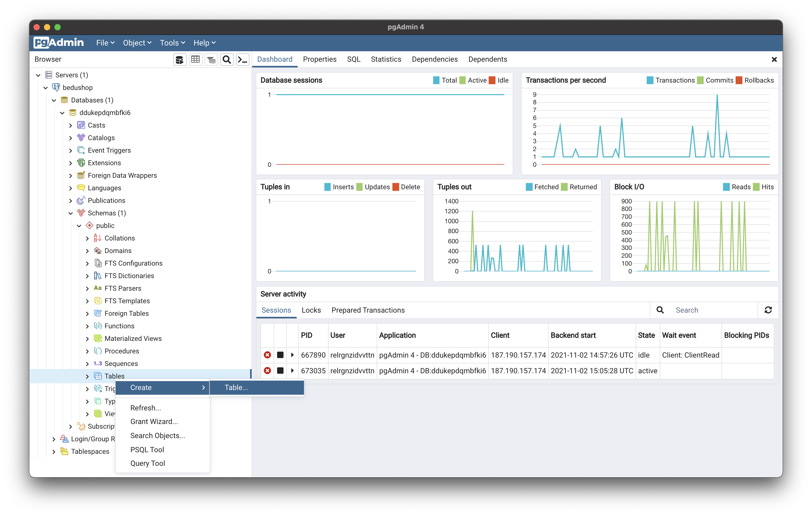

3. Esto abre una nueva ventana en la cual podemos crear una tabla nueva de nuestra base de datos. Recordemos que cada una de las entidades que definimos en el ejemplo 1 corresponde con una tabla en nuestra base de datos. Y los atributos son las columnas de la tabla.

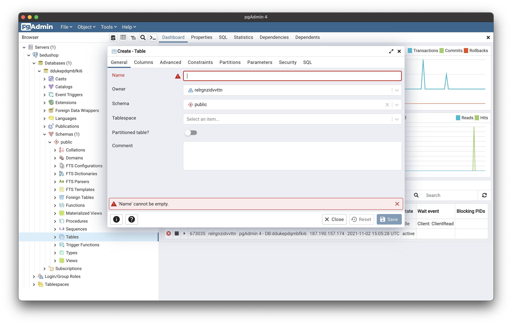

4. En este caso definiremos la tabla de productos. Por lo que en el nombre de la tabla colocamos Producto, el resto de las opciones de esa pestaña las dejamos con sus valores por default. 

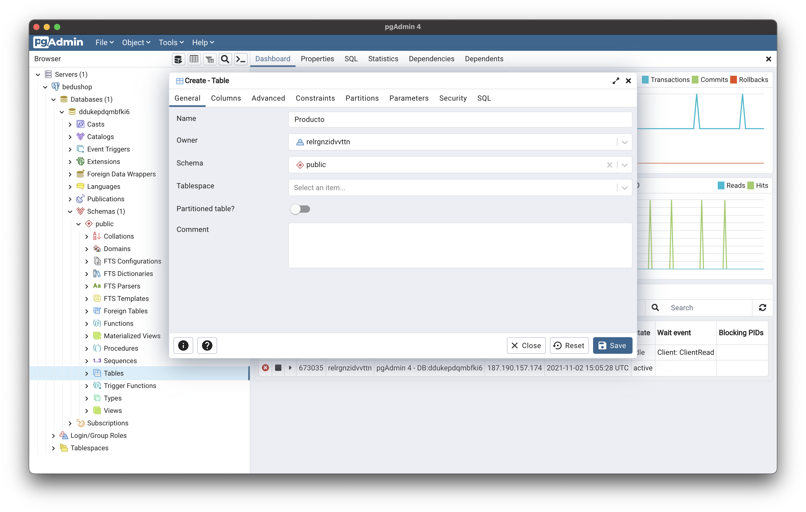

5. Vamos a la pestaña de **Columns** y agregamos 5 columnas, cada una para los atributos que definimos para los productos.

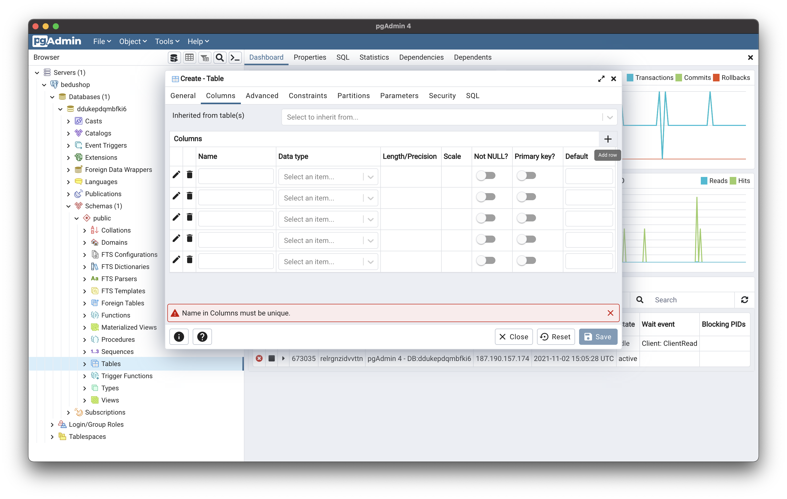

6. Llenamos las columnas para que queden de la siguiente forma, que corresponde con la entidad que definimos.

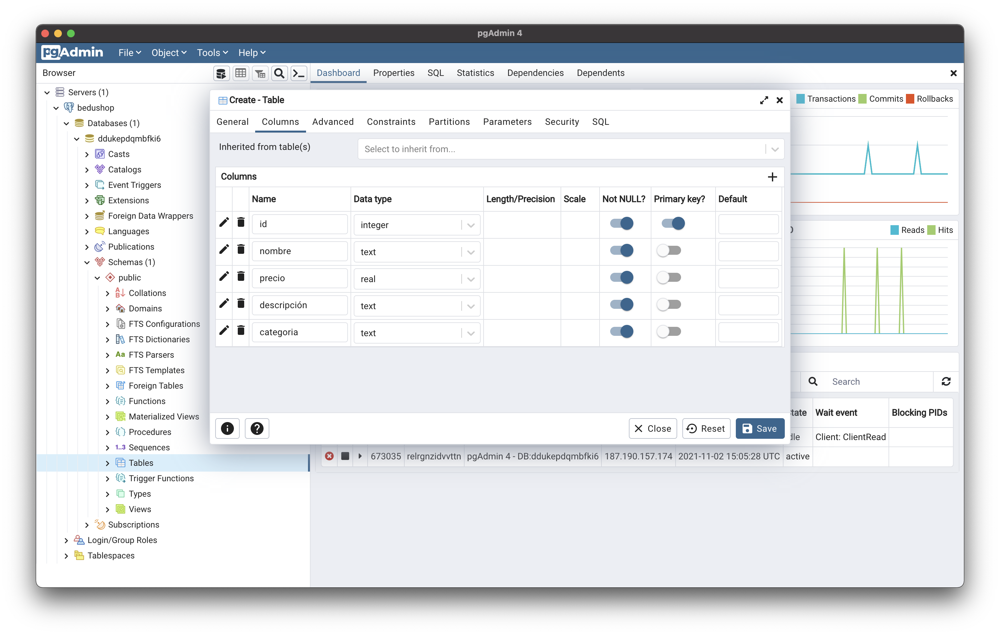

En este caso seleccionamos el tipo de dato para cada uno de los atributos, en esta [liga](https://www.postgresql.org/docs/9.5/datatype.html) puedes encontrar una lista completa de los tipos de dato de postgreSQL y que representa cada uno. 

7. Damos click en **Save** y vemos como se agrega la tabla a nuestro esquema.

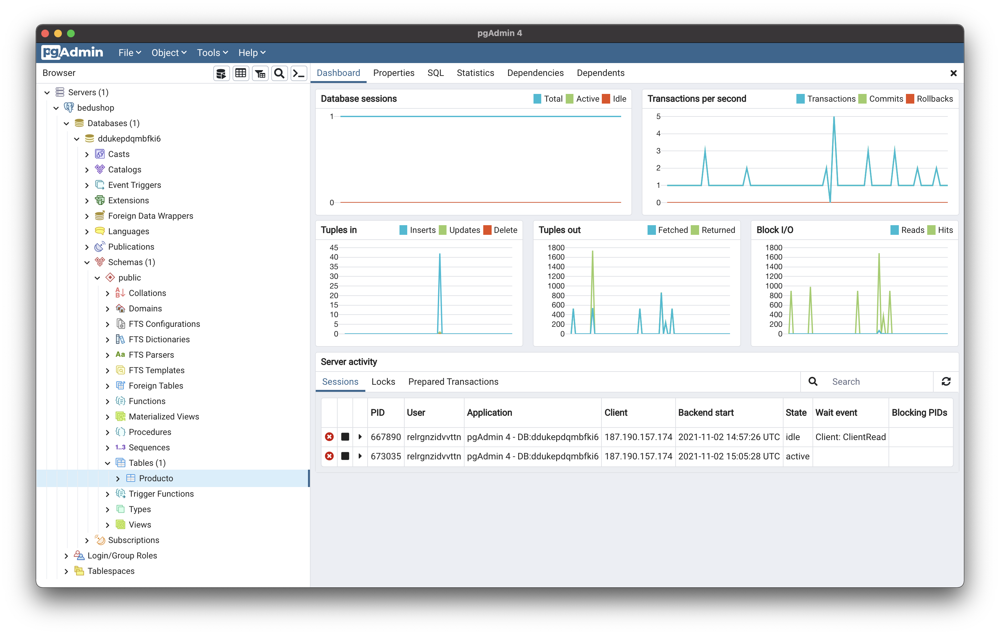

### Poblar la tabla. 

Al proceso de agregar información a una tabla se le conoce como poblarla. En este caso no contamos con la información de los productos, así que crearemos un conjunto de datos fake que nos servirá para poder poblar nuestra tabla.

8. Entramos a [Mockaroo](https://www.mockaroo.com/) que es la herramienta que usaremos para crear los datos.

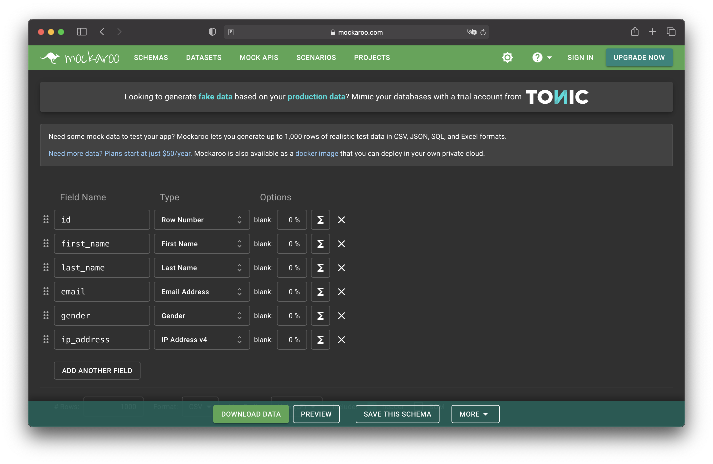

9. Ahora le indicaremos como deben ser los registros que tiene que crear, para eso usaremos los mismos atributos de producto para que genere datos que correspondan. Llenamos los campos de la siguiente forma. Vamos a pedir que genere 100 registros en formato CSV. Y damos click en **DOWNLOAD DATA** 

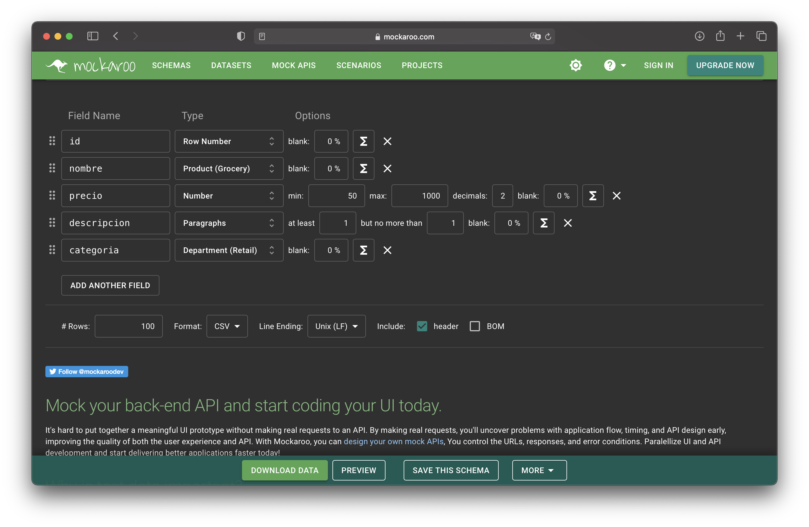

11.Esto va a descargar un archivo CSV que cargaremos a la base de datos que se ve de la siguiente forma.

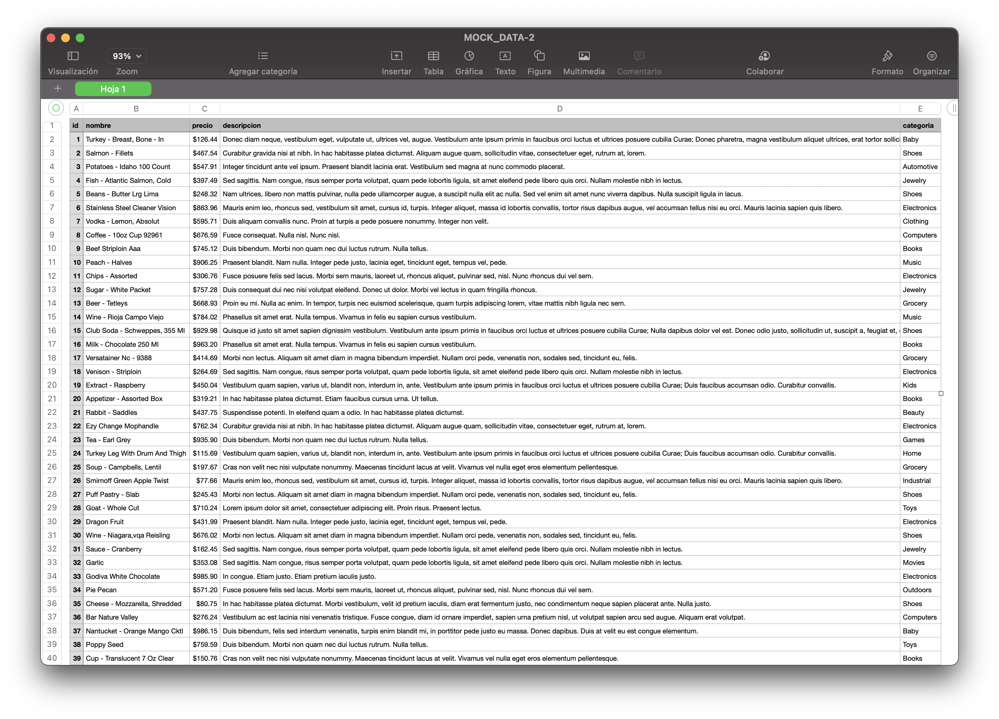

12. Ahora en pgAdmin vamos a cargar estos datos a la tabla de productos. Damos click derecho sobre el nombre de la tabla y seleccionamos la opción **import/export**

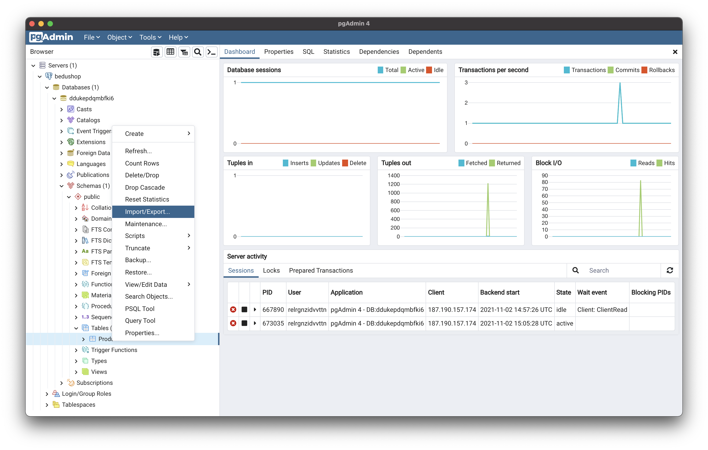

13. Seleccionamos la opción **Import** y buscamos el CSV generado con Mockaroo.

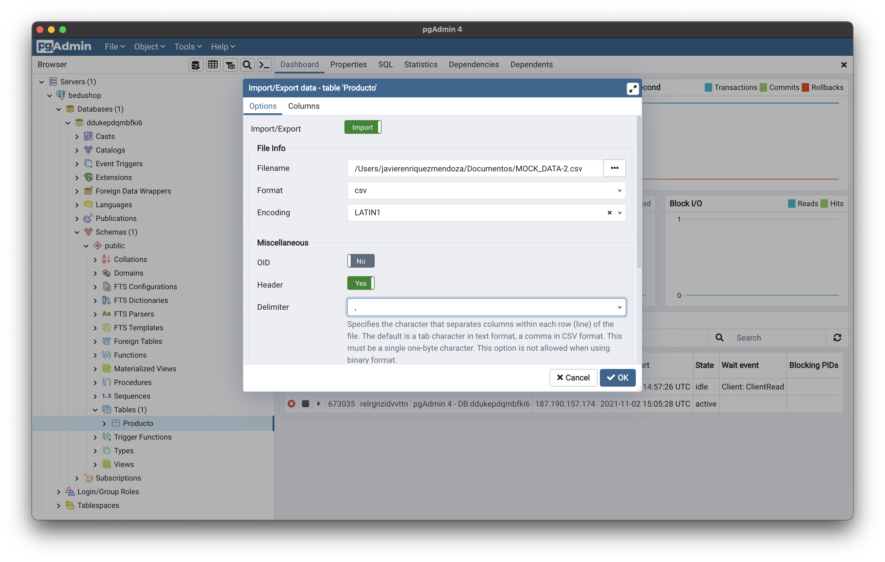

14. Debe aparecer un mensaje e éxito en la carga.

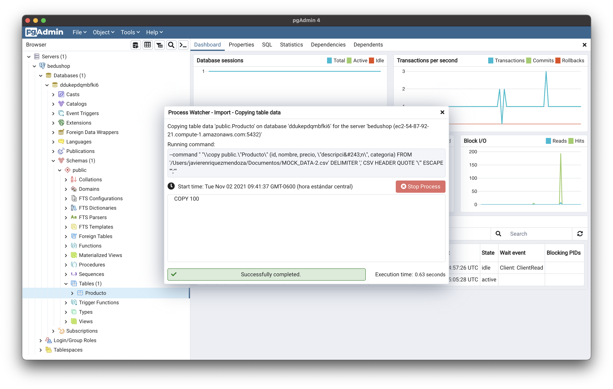

15. Para verificar que realmente se cargaron los datos damos click derecho en el nombre de la tabla **View/Edit data > All Rows** y deben aparecer los 100 registros cargados.

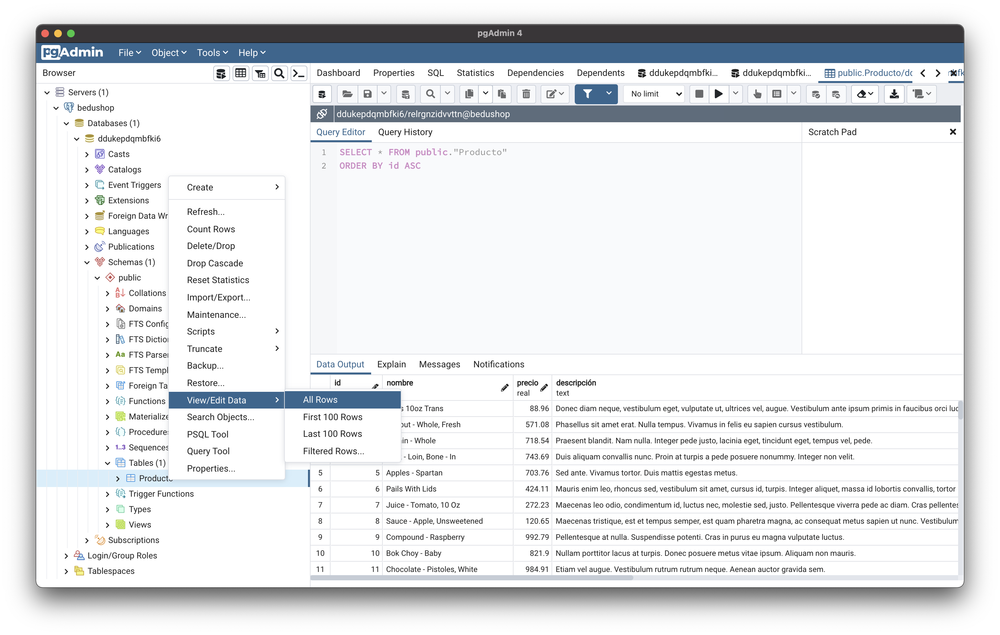

[`Atrás: Ejemplo-02`](../Ejemplo-02) | [`Siguiente: Reto-02`](../Reto-02)
