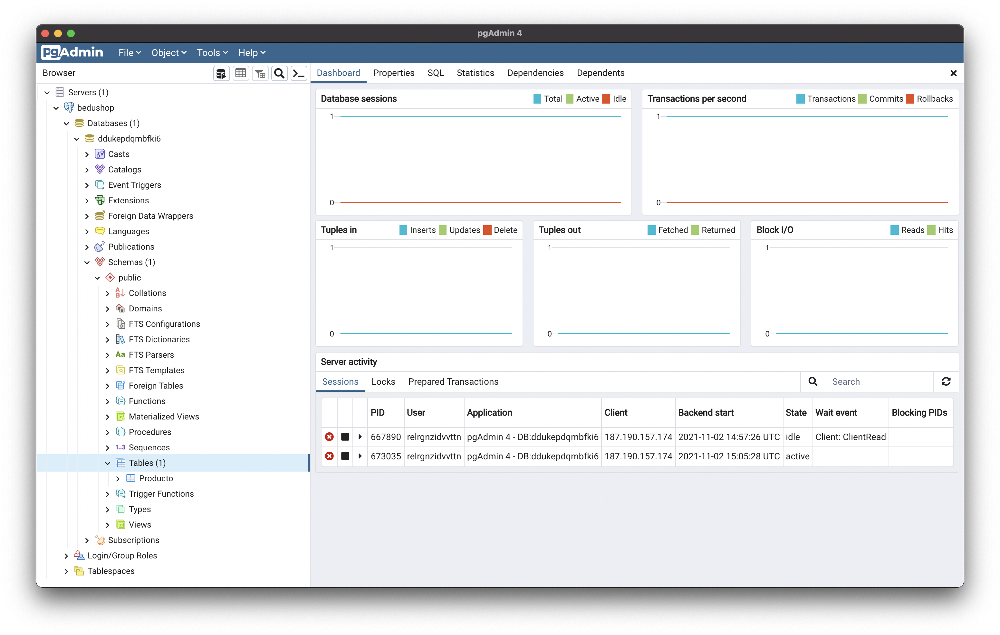
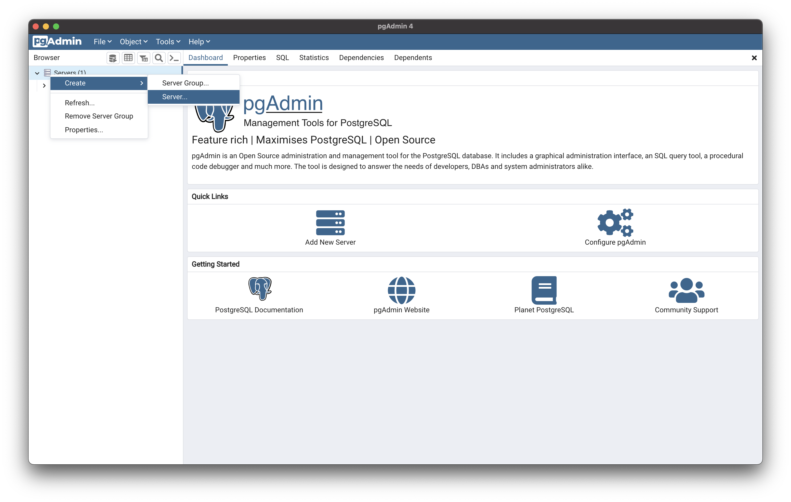
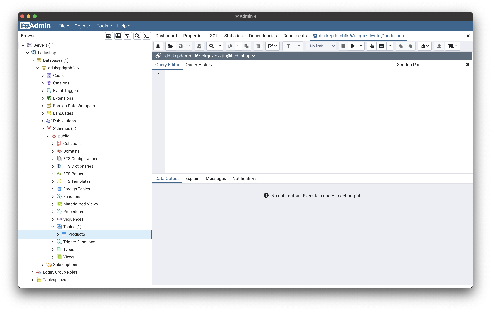
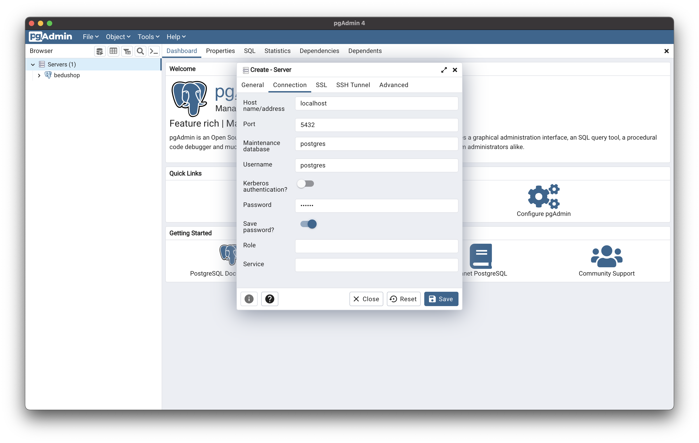
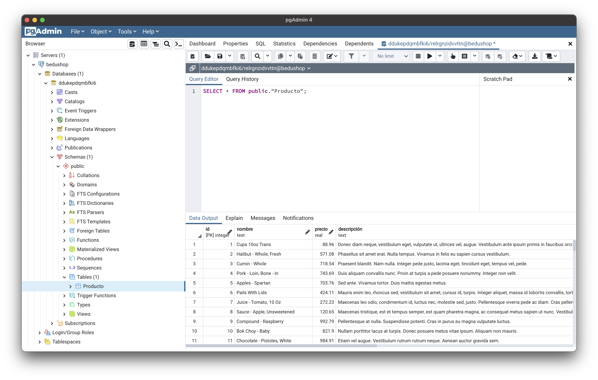
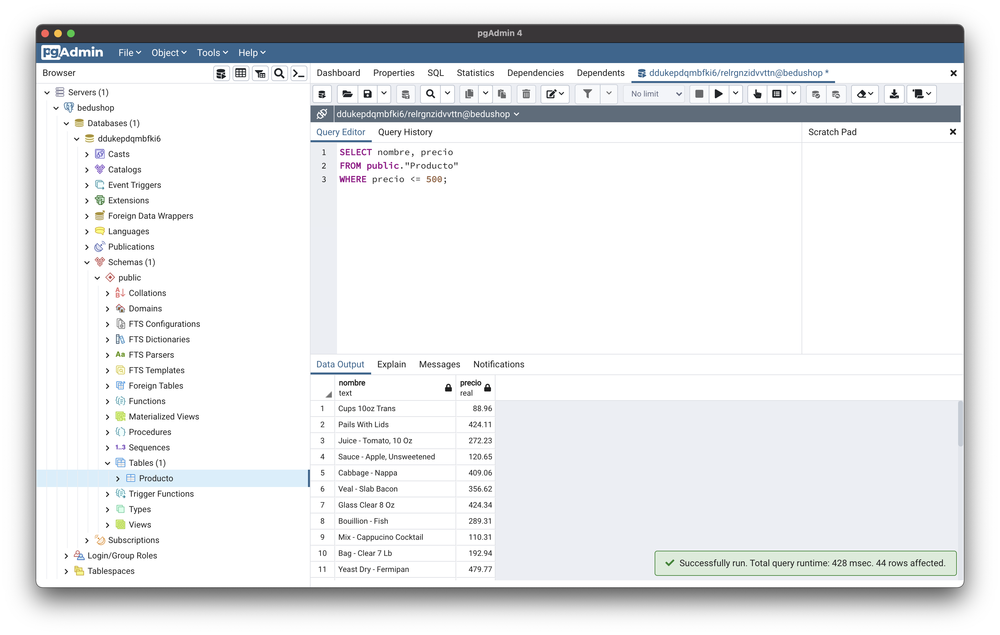
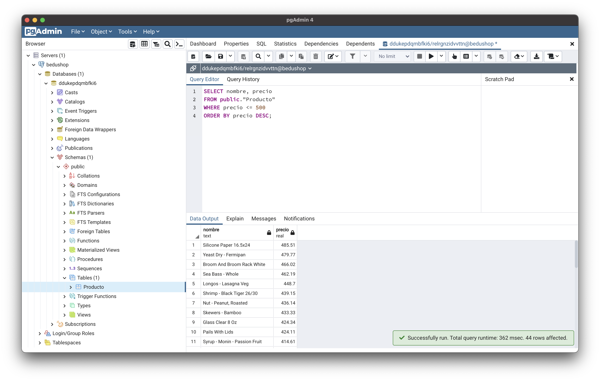

[`Backend Fundamentals`](../../README.md) > [`Sesión 02: Introducción a Bases de datos`](../README.md/) > `Ejemplo 4`

# Ejemplo 4: Queries

**Objetivo:**

- Hacer consultas secillas a la base de datos.

**Requisitos:**

- pgAdmin
- La base de datos para BeduShop
- Las tablas con datos

## Desarrollo

1. Abrimos pgAdmin y entramos a **Servers > bedushop > DBNAME > Schemas > Tables**



2. Damos click derecho sobre la tabla **Producto** y seleccionamos **Query Tool**.

 

3. Esto va a abrir una nueva pestaña en la que podremos escribir nuestras consultas a la base de datos.



4. En su forma más básica una consulta se compone de:

- Una cláusula `SELECT` que indica los campos de la tabla que se desean obtener.
- Una cláusula `FROM` que indica de dónde obtener los datos.
- Una cláusula `WHERE` que representa los filtros que podemos hacerle a los datos.

Por ejemplo, para seleccionar unicamente los nombres de todos los productos la consulta es:

```SQL
SELECT nombre FROM public."Producto";
```

La escribimos en el editor de consultas y damos click en el botón de play de la parte superior, esto nos muestra el resultado de nuestra consulta.



5. Si queremos obtener todos los campos, en lugar de enlistarlos todos podemos usar un * .

```SQL
SELECT * FROM public."Producto";
```



6. Ahora filtraremos el nombre y el precio de todos los productos que tengan un precio menor o igual a 500. 

```SQL
SELECT nombre, precio 
FROM public."Producto" 
WHERE precio <= 500;
```



7. Adicional a la restricción `WHERE`, es posible añadir otras restriccioens, por ejemplo, la restricción `ORDER BY` que permite ordenar los resultados de una consulta de manera ascendente (`ASC`) o descendente (`DESC`) a partir de un campo. Por ejemplo, la siguiente consulta muestra los resultados ordenados de mayor a menor a partir del campo `precio`.


```SQL
SELECT nombre, precio 
FROM public."Producto" 
WHERE precio <= 500
ORDER BY precio DESC;
```



8. Otra restricción es `LIMIT` que permite limitar el número de registros en una consulta. Esto es útil principalmente cuando se tienen miles de millones de registros y no se necesitan mostrar todos.


```SQL
SELECT nombre, precio 
FROM public."Producto"
LIMIT 5;
```


[`Atrás: Reto-02`](../Reto-02) | [`Siguiente: Reto-03`](../Reto-03)
